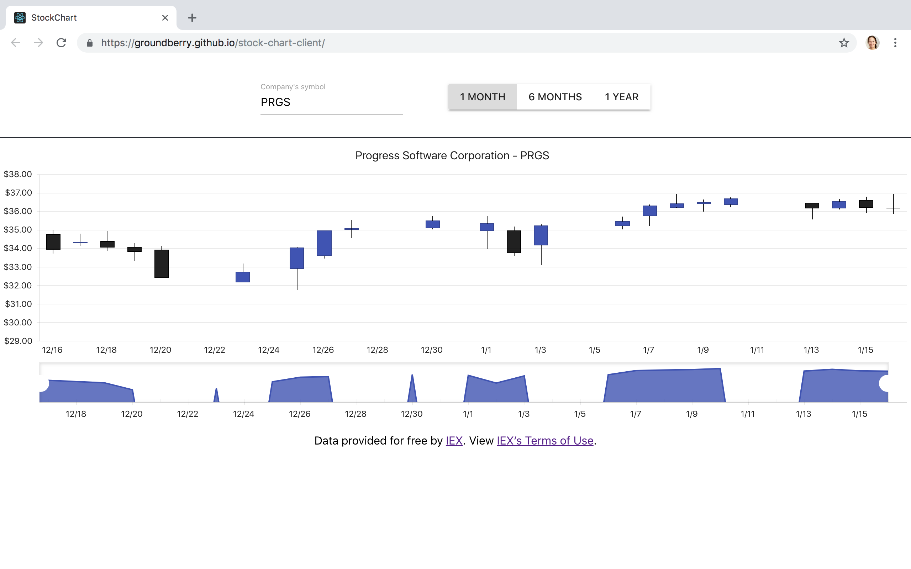

# StockChart

***StockChart*** is a tool to check stock data in real time. Users can view stock data from a selected company by entering it's symbol in a form input field. Users are also allowed to set the desired range for the rendering of the stock data, choosing between 1 month, 6 months, and 1 year.

## Functionality

- As a user, I can enter the symbol of a company.
- As a user, I can select a range to view stock data.
- As a user, I can view the stock data displayed in a stock chart.



## Running the app

Clone this repo:

```
$ git clone https://github.com/groundberry/stock-chart-client
```

Install all dependancies:

```
$ npm install
```

Start the server:

```
$ npm start
```

And open the app in your browser at <http://localhost:3000/>.


## Testing the app

Run the tests:

```
$ npm run test
```
